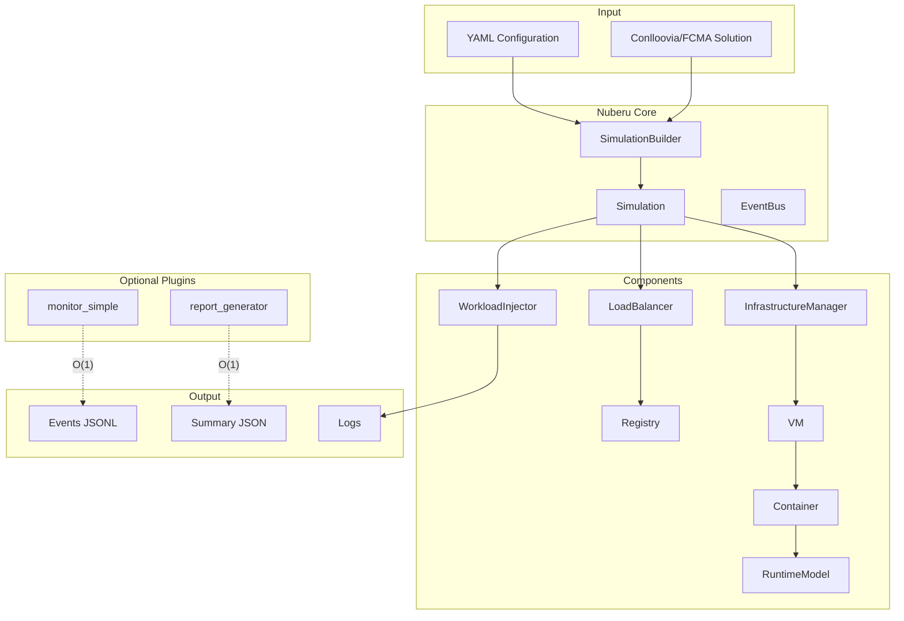
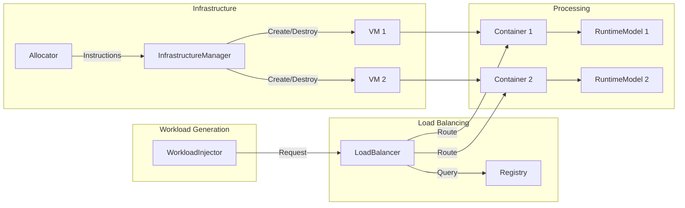
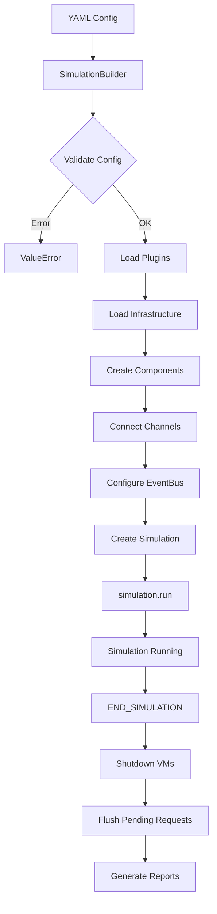

# Architecture Overview

> Reference document for understanding the global structure of the Nuberu cloud infrastructure simulator.

## What is Nuberu?

**Nuberu** is a discrete-event simulation framework for modeling serverless cloud infrastructures. It simulates the behavior of VMs, containers, load balancers, and workloads to evaluate costs, performance, and scaling policies.

Built on top of [aSimPy](https://github.com/jldiaz-uniovi/asimpy) (a SimPy fork) and extended via [pluggy](https://pluggy.readthedocs.io/), Nuberu is designed to be modular, extensible, and suitable for academic research and production planning alike.



---

## Component Diagram



## Components

| Component | Description |
|-----------|-------------|
| **Simulation** | Top-level facade that coordinates all components. Starts and stops the simulation. |
| **SimulationBuilder** | Constructs the simulation from a YAML configuration file. Loads plugins and validates the configuration. |
| **WorkloadInjector** | Generates requests according to a configured distribution (Poisson, uniform, etc.). |
| **LoadBalancer** | Distributes requests among available containers. Implementations: simple round-robin, Smooth WRR, weighted. |
| **Registry** | Registry of available containers per application. Filters out containers in drain mode. |
| **InfrastructureManager** | Manages the lifecycle of VMs and Containers. Receives instructions from the Allocator. |
| **Allocator** | Reads the allocation solution (e.g., from Conlloovia) and emits scaling instructions. |
| **VM** | Virtual machine with resources (CPU, memory). Contains multiple Containers. |
| **Container** | Processes requests. Has an associated RuntimeModel. Supports drain mode for graceful shutdown. |
| **RuntimeModel** | Models service time. Implementations: simple (fixed time based on RPS). |
| **EventBus** | Pub/sub system for decoupled communication between components. |

---

## Event System (EventBus)

The EventBus enables decoupled communication via publish/subscribe:

| Category | Event | When Published |
|----------|-------|----------------|
| **Allocation** | `ALLOCATION_RECEIVED` | Allocator receives a new allocation |
| | `ALLOCATION_APPLIED` | Instructions applied to infrastructure |
| **Infrastructure** | `INFRASTRUCTURE_READY` | InfrastructureManager finishes applying changes |
| | `VM_STARTED` | VM starts |
| | `VM_STOPPED` | VM stops |
| **Containers** | `CONTAINER_READY` | Container ready to receive requests |
| | `CONTAINER_DRAINING` | Container in drain mode (no new requests) |
| | `CONTAINER_STOPPED` | Container stopped |
| | `CONTAINER_REMOVED` | Container removed from Registry |
| **Requests** | `REQUEST_GENERATED` | WorkloadInjector generates a new request |
| | `REQUEST_COMPLETED` | Request completed (round-trip) |
| | `REQUEST_REJECTED` | Container rejected a request |
| | `REQUEST_LOST` | Request lost (timeout/interruption) |
| **System** | `END_SIMULATION` | stop_time reached, triggers shutdown |
| | `SIMULATION_FINISHED` | All shutdown complete, triggers reporting |
| | `COST_FINAL` | Final cost report (published by CostModels) |

### Event Structure

```python
@dataclass
class Event:
    topic: EventTopic           # Event type
    payload: dict[str, object]  # Event-specific data
    sim_time: float             # Simulation time when published
    origin: str | None          # Publishing component (optional)
    correlation_id: str | None  # ID for correlating events (optional)
    event_id: str               # Unique event ID
```

---

## Plugin System

Nuberu uses **pluggy** for extensibility. Plugins implement "hooks" defined in `hookspecs.py`.

### Plugin Types

| Type | Hook | Examples |
|------|------|----------|
| **Infrastructure** | `get_infrastructure_factory` | conlloovia, fcma |
| **Performance Data** | `get_rps_for_app_factory` | conlloovia, fcma |
| **Allocation** | `get_allocations_factory` | conlloovia, fcma |
| **Load Balancer** | `get_load_balancer_factory` | simple, smoothWRR, weighted |
| **Runtime Model** | `get_runtime_model_factory` | simple |
| **Distribution** | `get_interarrival_times_factory` | poisson, poisson-dynamic, uniform |
| **Cost Model** | `get_cost_model_factory` | spot |
| **Custom Plugin** | `get_factory` | example-custom, custom-monitor, report-generator |

### Official Plugins

| Plugin | Type | Description |
|--------|------|-------------|
| `nuberu-plugin-conlloovia-data-provider` | Data Provider | Reads Conlloovia solutions from pickle files |
| `nuberu-plugin-fcma-data-provider` | Data Provider | Reads FCMA solutions from pickle files |
| `nuberu-plugin-load-balancer` | Load Balancer | Simple round-robin balancer |
| `nuberu-plugin-smoothwrr-load-balancer` | Load Balancer | Smooth Weighted Round Robin |
| `nuberu-plugin-weighted-load-balancer` | Load Balancer | Weighted Round Robin |
| `nuberu-plugin-runtime-model-simple` | Runtime Model | Service time based on RPS |
| `nuberu-plugin-poisson-distribution` | Distribution | Poisson arrival distribution |
| `nuberu-plugin-poisson-dynamic-distribution` | Distribution | Poisson with dynamic rate |
| `nuberu-plugin-uniform-distribution` | Distribution | Uniform distribution |
| `nuberu-plugin-cost-spot` | Cost Model | Spot pricing cost model |
| `nuberu-plugin-example-custom` | Custom | Example custom plugin |
| `nuberu-plugin-custom-monitor` | Custom | Simple monitor exporting events to JSONL |
| `nuberu-plugin-report-generator` | Custom | Report generator with summary statistics |

> For details on creating your own plugins, see the [Writing Plugins](../guides/writing-plugins.md) guide.

---

## Simulation Build Flow



### Build Steps

1. **Validation**: Pydantic validates the YAML against `SimulationConfig`
2. **Plugins**: PluginManager loads plugins as specified in config
3. **Infrastructure**: Apps, InstanceClasses, and ContainerClasses are loaded
4. **Components**: All components are created (LB, WI, IM, custom plugins, etc.)
5. **Channels**: DuplexChannels are connected between components
6. **EventBus**: Components subscribe to their topics of interest
7. **Run**: Simulation processes are launched
8. **Shutdown**: Containers are handled according to drain mode configuration

---

## Key Principles

1. **Decoupled**: Components communicate via EventBus and Channels
2. **Plugin-first**: Extensible functionality is implemented as plugins
3. **aSimPy**: Used for discrete-event simulation (SimPy fork)
4. **Bidirectional**: Requests make a full round-trip (forward and backward)
5. **Timeline**: Each request carries a history of where it went and when
6. **Terminal states**: A request ends as COMPLETED, REJECTED, or LOST
7. **Pydantic**: All configuration is validated with Pydantic models
8. **Protocols**: Contracts are defined using `typing.Protocol`
9. **Drain mode**: Containers can wait to finish pending requests before stopping
10. **Network delays**: Network latencies are configurable per layer

---

## Glossary

| Term | Definition |
|------|------------|
| **App** | Logical application that receives requests (e.g., "web-frontend", "api-backend") |
| **InstanceClass** | VM type with specific resources (e.g., "m5.large": 2 cores, 8 GB RAM) |
| **ContainerClass** | Container type with resource requirements (e.g., "worker-small": 0.5 cores) |
| **VM** | Virtual machine that runs multiple containers |
| **Container** | Processing unit that runs an application |
| **RuntimeModel** | Model that determines how long a request takes to process |
| **Request** | Individual client petition to an application |
| **Timeline** | Event history of a request (for debugging and metrics) |
| **Allocation** | Decision of how many containers/VMs to create for each app |
| **drain_pending_requests** | If true, when stopping a container, wait for in-flight requests to complete |
| **eager_start** | If true, apply first allocation immediately without waiting |
| **allocator_interval** | Seconds between allocation cycles |
| **DuplexChannel** | Bidirectional channel for request/response communication |
| **RPS** | Requests Per Second — processing capacity of a container |

---

## Further Reading

- [Request Lifecycle](./request-lifecycle.md) — Full journey of a request through the system
- [Channels and Latency](./channels-and-latency.md) — Communication architecture and network delays
- [Drain Mode](./drain-mode.md) — Graceful container shutdown
- [Monitoring and Metrics](./monitoring-and-metrics.md) — How metrics are captured and analyzed
- [Writing Plugins](../guides/writing-plugins.md) — How to extend Nuberu
- [Configuration Reference](../configuration-reference.md) — Complete YAML configuration guide
