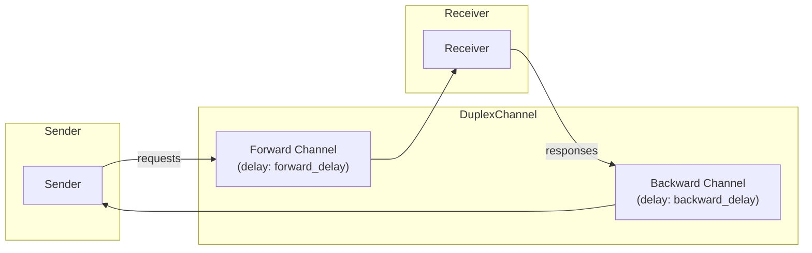
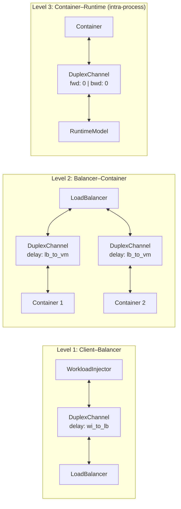
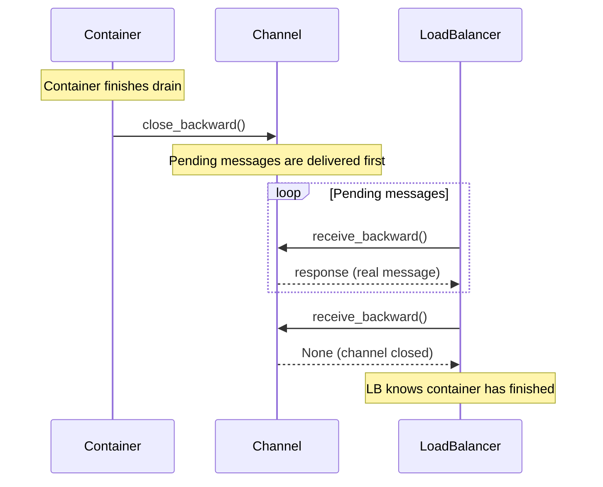

# Channels and Network Latency

> How Nuberu models bidirectional communication and network delays between components.

## Duplex Channels

Nuberu implements a system of **bidirectional channels (DuplexChannel)** that model request-response communication between components. Each duplex channel encapsulates two independent unidirectional channels:



### Key Properties

- **Non-blocking sends**: `send()` returns immediately; the message arrives after the configured delay. This means multiple concurrent sends at `t=0` all arrive at `t=delay`, not cumulatively.
- **Configurable delay per direction**: Forward and backward channels can have different delays (asymmetric latency).
- **Half-close semantics**: Each direction can be closed independently, similar to TCP. The close signal itself is subject to the channel's delay ("Traveling Sentinel"), ensuring all previously sent messages arrive before the closure is detected by the receiver.

---

## Connection Topology

The system uses **three levels of duplex channels**:



> **Note on Level 3**: Unlike Levels 1 and 2, the Container–RuntimeModel channel does **not** model network latency. It uses 0 as forward delay and 0 as backward delay (simulating the RuntimeModel running inside the same container process), so responses are instantaneous.

Every Container has a **dedicated** duplex channel to the LoadBalancer. Responses travel back through the **same channel** they arrived on, ensuring correct routing without any additional lookup.

---

## Configuring Network Delays

### Basic Configuration (Symmetric)

```yaml
network_delays:
  wi_to_lb: 10.0              # ms, WorkloadInjector ↔ LoadBalancer
  lb_to_vm_default: 5.0       # ms, LoadBalancer ↔ VM (default)
```

### Asymmetric Delays

For modeling scenarios like asymmetric bandwidth links:

```yaml
network_delays:
  wi_to_lb: 10.0
  wi_to_lb_backward: 15.0       # ms, LB -> WI (defaults to wi_to_lb if omitted)
  lb_to_vm_default: 5.0
  lb_to_vm_default_backward: 8.0  # ms, VM -> LB (defaults to lb_to_vm_default if omitted)
```

### Delay Parameters

| Parameter | Type | Description |
|-----------|------|-------------|
| `wi_to_lb` | Network | Client-to-balancer latency (forward) |
| `wi_to_lb_backward` | Network | Balancer-to-client latency (backward). Default: same as `wi_to_lb` |
| `lb_to_vm_default` | Network | Balancer-to-VM latency (forward) |
| `lb_to_vm_default_backward` | Network | VM-to-balancer latency (backward). Default: same as `lb_to_vm_default` |
| `vm_container_overhead` | Overhead | Container startup overhead (not network latency) |
| `drain_grace_period` | Overhead | Grace period (ms) for in-flight requests during container drain (default: 500ms) |

---

## Per-VM and Per-Workload Overrides

The system supports **granular overrides** to model heterogeneous environments:

### Per-VM Overrides

Simulate VMs in distant availability zones:

```yaml
vm_network_overrides:
  - name: "vm-remote-az"
    network_delay: 50.0           # ms, LB -> this VM
    network_delay_backward: 60.0  # ms, this VM -> LB (optional)
```

### Per-Workload Overrides

Simulate clients connecting from different geographic regions:

```yaml
workload_network_overrides:
  - app: "app_remote_region"
    network_delay: 100.0            # ms, WI -> LB for this app
    network_delay_backward: 120.0   # ms, LB -> WI for this app (optional)
```

---

## Response Time Formula

The total response time of a request includes **all delays along the path**:

```
T_response = T_wi_lb_fwd + T_lb_vm_fwd + T_queue + T_service + 
             T_vm_lb_bwd + T_lb_wi_bwd
```

With asymmetric delays, the forward and backward latencies may differ, enabling simulation of scenarios such as links with different upload/download bandwidths.

---

## Half-Close Semantics

Channels support **unidirectional close** (half-close), which is critical for [drain mode](./drain-mode.md):



**Characteristics:**
- `close()` enqueues an internal sentinel (never visible to the application)
- `receive()` returns `None` when the channel is closed and empty
- Pending messages are delivered **before** signaling closure
- `send()` on a closed channel raises `ChannelClosedError`

---

## Realistic Scenarios Enabled

The network layer enables simulation of scenarios that are impossible in idealized models:

| Scenario | How It's Modeled |
|----------|-----------------|
| **Multi-AZ latency** | Per-VM overrides with different delays |
| **Remote clients** | Per-workload overrides |
| **Cold starts** | `vm_container_overhead` for serverless startup |
| **Network partitions** | Extreme delays to simulate partial failures |
| **Asymmetric links** | Different forward/backward delays |

---

## Further Reading

- [Request Lifecycle](./request-lifecycle.md) — How delays contribute to total response time
- [Drain Mode](./drain-mode.md) — How half-close is used during graceful shutdown
- [Configuration Reference](../configuration-reference.md) — Full `network_delays` specification
