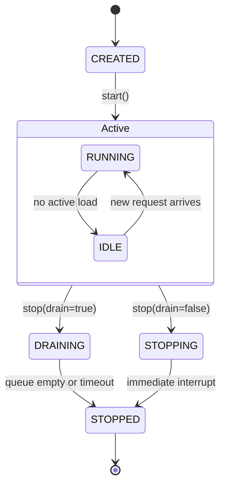
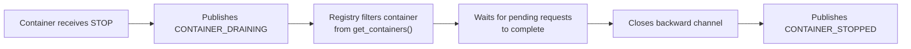
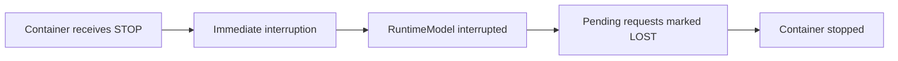

# Drain Mode

> Understanding graceful container shutdown in Nuberu.

## Overview

When a container must stop (e.g., at the end of a simulation or during infrastructure scaling), Nuberu supports two termination modes, configurable via `drain_pending_requests`:

| Mode | Config Value | Behavior | Typical Use |
|------|-------------|----------|-------------|
| **Drain** | `true` | Waits for in-flight requests to complete before stopping | Production evaluation, QoS analysis |
| **Hardstop** | `false` | Interrupts immediately; pending requests are marked LOST | Fast testing, failure simulation |

---

## Configuration

```yaml
simulation:
  drain_pending_requests: true   # Enable drain mode (default: false)
```

---

## Container States



| State | Description |
|-------|-------------|
| `CREATED` | Container instantiated but not started |
| `RUNNING` | Processing requests normally |
| `IDLE` | Running but not handling any load |
| `STOPPING` | Stopping immediately (hardstop) |
| `DRAINING` | Waiting to complete pending requests |
| `STOPPED` | Fully stopped |

---

## Drain Mode Flow

When drain mode is enabled, the container finishes all pending requests before shutting down:



**What happens:**
1. Container enters `DRAINING` state and publishes `CONTAINER_DRAINING`
2. Registry marks the container as draining — no new requests are routed to it
3. RuntimeModel continues processing queued requests
4. When the queue is empty, the container closes its backward channel (half-close)
5. LoadBalancer detects the closure (`receive_backward()` returns `None`)
6. Container publishes `CONTAINER_STOPPED` and transitions to `STOPPED`

---

## Hardstop Mode Flow

When drain is disabled, the container stops immediately:



**What happens:**
1. Container interrupts the RuntimeModel process
2. The currently processing request (if any) is marked as `LOST`
3. All remaining queued requests are also marked as `LOST`
4. Container transitions directly to `STOPPED`

---

## Comparison

| Aspect | Hardstop (`drain=false`) | Drain (`drain=true`) |
|--------|--------------------------|----------------------|
| Request in process | LOST | COMPLETED |
| Requests in queue | LOST | COMPLETED |
| Events published | `REQUEST_LOST` | `REQUEST_COMPLETED` |
| Shutdown time | Immediate | Until queue is drained |
| Full timeline | Incomplete | Complete |
| Latency measurable | No | Yes |

---

## Safety Mechanisms

Drain mode includes safeguards to prevent indefinite blocking:

| Mechanism | Purpose |
|-----------|---------|
| **Idle signal** | RuntimeModel signals when queue is empty and no request is being processed |
| **Progress timer** | If no request completes within a timeout, force interrupt |
| **Hard deadline** | Absolute time limit for the drain process |

These ensure that even if a RuntimeModel gets stuck, the simulation will always terminate.

---

## When to Use Each Mode

**Use Drain mode when:**
- You need accurate latency measurements for all requests
- You're evaluating Quality of Service (QoS)
- You want complete request timelines for post-hoc analysis
- You're comparing load balancer algorithms

**Use Hardstop mode when:**
- Running quick smoke tests
- Simulating hardware failures or crash scenarios
- Speed is more important than metric completeness
- Debugging non-latency-related issues

---

## Further Reading

- [Request Lifecycle](./request-lifecycle.md) — How requests reach terminal states
- [Channels and Latency](./channels-and-latency.md) — Half-close semantics used by drain mode
- [Monitoring and Metrics](./monitoring-and-metrics.md) — Analyzing drain mode results
- [Configuration Reference](../configuration-reference.md) — All simulation parameters
