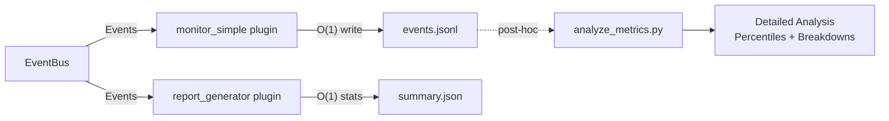

# Monitoring and Metrics

> How Nuberu captures, reports, and analyzes simulation metrics.

## Architecture Overview

Nuberu uses a **3-layer monitoring architecture** designed for O(1) memory during simulation and unlimited analysis afterwards:



| Layer | Component | Memory | Output | When |
|-------|-----------|--------|--------|------|
| 1 | `monitor_simple` | O(1) | Raw events (JSONL) | During simulation |
| 2 | `report_generator` | O(1) | Summary statistics | At simulation end |
| 3 | `analyze_metrics.py` | O(n) | Full analysis with percentiles | Post-hoc, on demand |

---

## Layer 1: Event Capture (`monitor_simple`)

Writes raw events to a JSONL file with O(1) memory — events are written directly to disk, not accumulated in memory.

### Configuration

```yaml
custom_plugins:
  - plugin_name: monitor_simple
    plugin_config:
      dump_file: ./metrics/events.jsonl
```

### What's Captured

All lifecycle events are recorded including: `REQUEST_GENERATED`, `REQUEST_COMPLETED`, `REQUEST_REJECTED`, `REQUEST_LOST`, `CONTAINER_READY`, `CONTAINER_DRAINING`, `CONTAINER_STOPPED`, `VM_STARTED`, `VM_STOPPED`, and more.

### Output Format

Each line in the JSONL file is a self-contained JSON object:

```json
{
  "request_id": "app0_req_123",
  "app_id": "app0",
  "arrival_time": 1.234,
  "finish_time": 1.456,
  "status": "completed",
  "timeline": [
    {"time": 1.234, "component_id": "Client_generated", "event": "checkpoint"},
    {"time": 1.235, "component_id": "LoadBalancer_lb-1", "event": "receive_from_wi"},
    {"time": 1.240, "component_id": "Container_c1", "event": "receive_from_lb"},
    {"time": 1.456, "component_id": "Runtime_c1_end_service", "event": "checkpoint"}
  ]
}
```

---

## Layer 2: Immediate Summary (`report_generator`)

Generates basic statistics at simulation end using Welford's algorithm for running statistics (O(1) memory).

### Configuration

```yaml
custom_plugins:
  - plugin_name: report_generator
    plugin_config:
      output_format: "json"   # Options: console, json, csv, jsonl
      output_path: "./reports/summary"
```

### Metrics Provided

| Metric | Description |
|--------|-------------|
| `generated` | Total requests generated |
| `completed` | Requests successfully completed |
| `rejected` | Requests rejected (queue full, no containers) |
| `lost` | Requests lost (timeout, interruption) |
| `mean_response_time` | Average response time |
| `min` / `max` / `stdev` | Basic latency statistics |
| `total_cost` | Total infrastructure cost |
| `completion_rate` | Percentage of completed requests |

> **Note**: This layer does **not** compute percentiles (p50, p95, p99) — that requires O(n) memory. Use `analyze_metrics.py` for percentile analysis.

---

## Layer 3: Post-Hoc Analysis (`analyze_metrics.py`)

Deep analysis of the JSONL file, run on demand after the simulation finishes.

### Usage

```bash
# Console output
python -m nuberu_plugin_custom_monitor.analyze_metrics ./metrics/events.jsonl

# Export to JSON
python -m nuberu_plugin_custom_monitor.analyze_metrics \
  ./metrics/events.jsonl \
  -o ./reports/detailed_analysis.json \
  -f json
```

### What It Provides

- **Percentiles**: p50, p90, p95, p99, p99.9 for response times
- **Breakdown**: Queue time, service time, and network delays analyzed separately
- **Per-app statistics**: All metrics broken down by application
- **Re-analyzable**: Run multiple times without re-simulating

### Example Output

```
======================================================================
 NUBERU SIMULATION ANALYSIS (Post-hoc from JSONL)
======================================================================

Summary:
  Total cost: $45.23
  Requests generated: 1234567
  Requests completed: 1200000
  Completion rate: 97.20%

Latency statistics (seconds):
  Mean: 0.8234
  Median (p50): 0.7890
  P95: 1.2345
  P99: 1.8976

Per-app statistics:
  App: app0
    Completed: 400000
    Latency (p50): 0.2012s
    Latency (p95): 0.2890s
======================================================================
```

---

## Recommended Setup

For most use cases, enable **both** monitoring plugins:

```yaml
custom_plugins:
  # Raw event capture for detailed analysis
  - plugin_name: monitor_simple
    plugin_config:
      dump_file: ./metrics/events.jsonl
  
  # Immediate summary at simulation end
  - plugin_name: report_generator
    plugin_config:
      output_format: "json"
      output_path: "./reports/summary"
```

### Typical Workflow

1. **Run simulation**: `uv run nuberu run config.yaml`
2. **Check quick summary** (automatic): ReportGenerator prints to console/file
3. **Deep analysis** (when needed): Run `analyze_metrics.py` on the JSONL
4. **Custom analysis** (optional): Write scripts to parse the JSONL for specific insights

---

## Storage Considerations

| Simulation Size | JSONL Size | Compressed |
|----------------|------------|------------|
| 10K requests | ~5 MB | ~0.5 MB |
| 100K requests | ~50 MB | ~5 MB |
| 1M requests | ~500 MB | ~50 MB |

The JSONL format is line-oriented and compresses well with gzip.

---

## Further Reading

- [Architecture Overview](./architecture-overview.md) — EventBus and component overview
- [Analyzing Results](../guides/analyzing-results.md) — Hands-on guide for working with metrics
- [Configuration Reference](../configuration-reference.md) — Plugin configuration options
