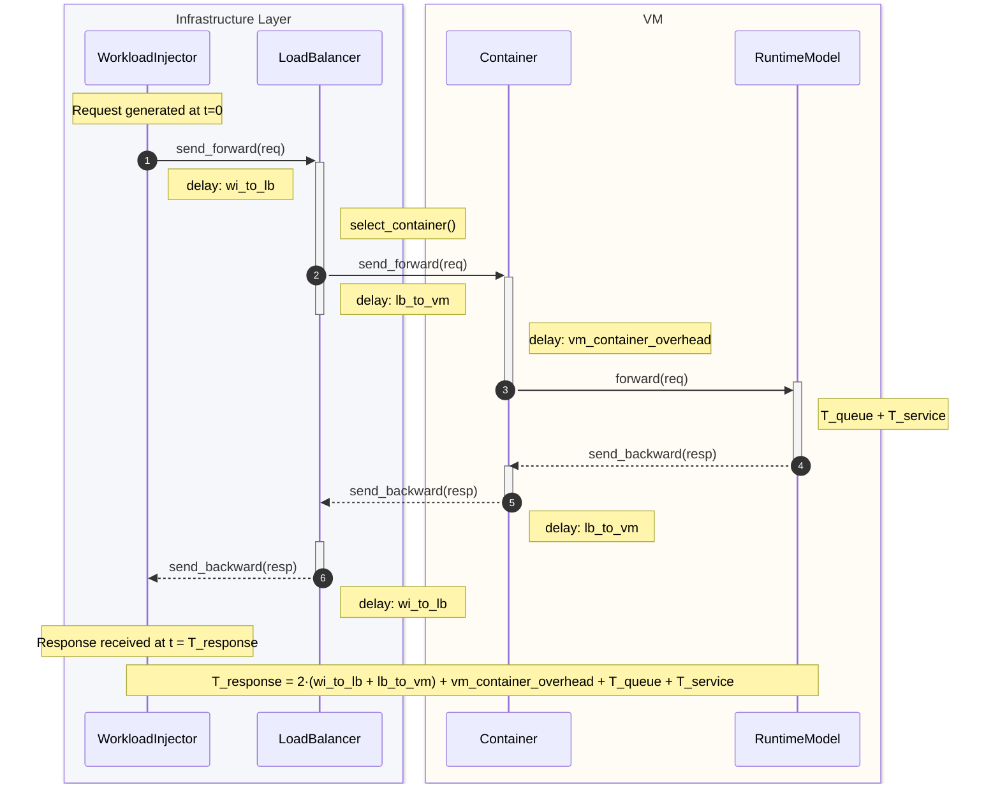
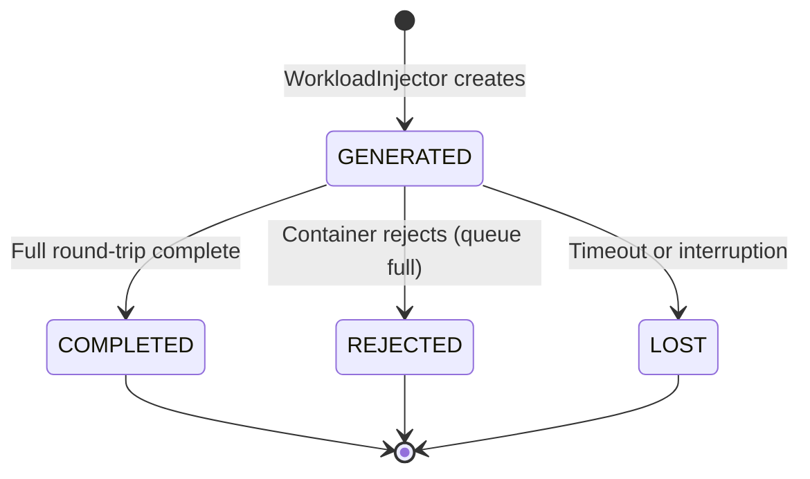

# Request Lifecycle

> How a request travels through the Nuberu simulation, from generation to completion.

## Overview

Every request in Nuberu follows a **bidirectional path**:

1. **Forward path**: WorkloadInjector -> LoadBalancer -> Container -> RuntimeModel
2. **Backward path**: RuntimeModel -> Container -> LoadBalancer -> WorkloadInjector

At each hop, configurable **network delays** are applied, simulating real cloud network latency.

---

## Sequence Diagram



## Time Components

| Symbol | Description | Source |
|--------|-------------|--------|
| `wi_to_lb` | Network delay between WorkloadInjector and LoadBalancer | `network_delays.wi_to_lb` |
| `lb_to_vm` | Network delay between LoadBalancer and Container | `network_delays.lb_to_vm_default` |
| `vm_container_overhead` | Container startup overhead (forward only) | `network_delays.vm_container_overhead` |
| `T_queue` | Queuing time in RuntimeModel (emergent) | M/D/1 model behavior |
| `T_service` | Processing time per request | `1 / RPS` |

> **Note**: With asymmetric delays (e.g., `wi_to_lb_backward`), the forward and backward path times may differ, modeling scenarios such as asymmetric bandwidth links.

---

## Request States

A request transitions through several states during its lifetime:



> **Note**: `RequestState` only has four explicit values: `GENERATED`, `COMPLETED`, `REJECTED`, and `LOST`. Intermediate progress (accepted, assigned, processing) is tracked via the request's `timeline` attribute, not as explicit state transitions.

### Terminal States

| State | Meaning | When |
|-------|---------|------|
| **COMPLETED** | Successfully processed and returned | RuntimeModel finished, response traversed backward path |
| **REJECTED** | Refused by the container | Queue was full (`queue_size` limit reached) |
| **LOST** | Interrupted or timed out | Container stopped (hardstop mode) or simulation ended |

> **Note**: Intermediate states (ACCEPTED, ASSIGNED, PROCESSING) are tracked via the request's `timeline` attribute, not as explicit states.

---

## Request Timeline

Each `Request` object carries a `timeline` — a list of timestamped checkpoints recording every component it visited. This is essential for debugging and metrics analysis.

### Example: Completed Request

```
t=0.000: Client_generated
t=0.010: Client_send_to_lb         ← +10ms (wi_to_lb delay)
t=0.010: LB_receive
t=0.015: Container_accept           ← +5ms (lb_to_vm delay)
t=0.017: Runtime_start_service      ← +2ms (vm_container_overhead)
t=0.997: Runtime_end_service        ← 980ms service time
t=0.997: Runtime_send_response
t=0.997: Container_send_to_lb
t=1.002: LB_send_to_client          ← +5ms (lb_to_vm backward)
t=1.012: Client_receive_response    ← +10ms (wi_to_lb backward)
```

**Total response time**: 1.012s

### Example: Lost Request (Hardstop)

```
t=0.000: Client_generated
t=0.010: Client_send_to_lb
t=0.010: LB_receive
t=0.015: Container_accept
t=0.017: Runtime_start_service
t=0.101: INTERRUPT (stop_time reached)
         Request marked LOST
         NO Client_receive_response
```

**Timeline**: Incomplete, no measurable latency.

---

## Conservation Law

A fundamental invariant of the simulation:

```
requests_generated == requests_completed + requests_rejected + requests_lost + requests_in_flight
```

At the end of simulation (after drain), `requests_in_flight` should be 0:

```
requests_generated == requests_completed + requests_rejected + requests_lost
```

---

## Further Reading

- [Architecture Overview](./architecture-overview.md) — Component descriptions and event system
- [Channels and Latency](./channels-and-latency.md) — How network delays work
- [Drain Mode](./drain-mode.md) — How drain vs hardstop affects requests
- [Configuration Reference](../configuration-reference.md) — Network delay configuration
