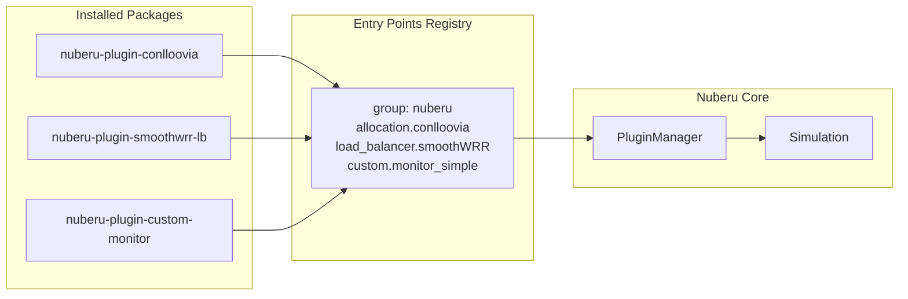
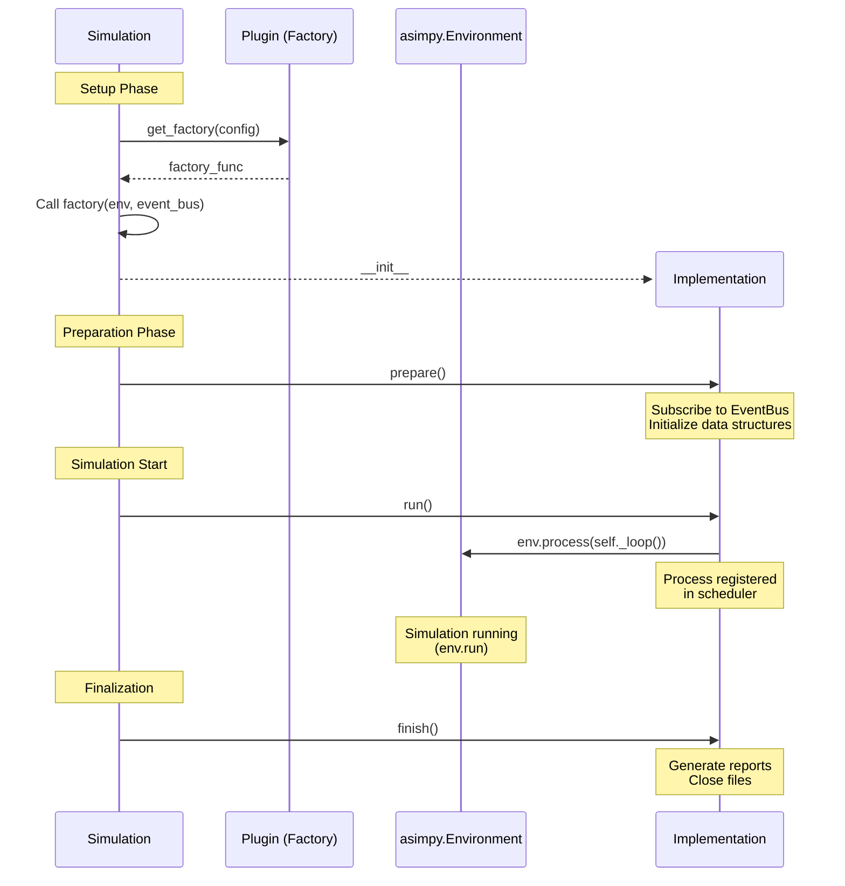

# Writing Plugins

> How to create, configure, and test plugins for Nuberu.

## Overview

Nuberu uses [pluggy](https://pluggy.readthedocs.io/) for extensibility and **setuptools entry points** for automatic plugin discovery. A plugin is a Python package that implements specific hooks to extend the simulation with new behaviors.

This guide focuses on **Custom Plugins** (monitoring, logging, metrics, integrations), which are the most common type for users to develop. The same patterns apply to all plugin types.

---

## Architecture



---

## Plugin Lifecycle

Every plugin has two phases:

### Phase 1: Configuration (Static)

Plugins are loaded and configured **before** the simulation exists. At this stage, the plugin only has access to static configuration from YAML.

### Phase 2: Runtime (Dynamic)

The simulation requires access to `Environment`, `EventBus`, and other runtime components which are only available once the simulation starts.

The **Factory Pattern** bridges this gap:



---

## Plugin Types

| Category | Type | Purpose | Specs Interface |
|----------|------|---------|----------------|
| **Core** | Infrastructure | Provides Apps, InstanceClasses, ContainerClasses | `InfrastructureSpecs` |
| **Core** | Allocation | Generates scaling instructions | `AllocationSpecs` |
| **Core** | LoadBalancer | Distributes requests among containers | `LoadBalancerSpecs` |
| **Core** | RuntimeModel | Models service time | `RuntimeModelSpecs` |
| **Core** | CostModel | Calculates infrastructure costs | `CostModelSpecs` |
| **Core** | Distribution | Generates inter-arrival times | `ArrivalDistributionSpecs` |
| **Custom** | Observability | Logging, metrics, reports | `CustomPluginSpecs` |

---

## Step-by-Step: Creating a Custom Plugin

### 1. Create the Package Structure

- `nuberu-plugin-my-monitor/pyproject.toml`
- `nuberu-plugin-my-monitor/src/nuberu_plugin_my_monitor/__init__.py`
- `nuberu-plugin-my-monitor/src/nuberu_plugin_my_monitor/plugin.py`

### 2. Define the Implementation Class

This is the runtime object that runs alongside the simulation. It must implement the `CustomPluginProtocol`:

```python
# src/nuberu_plugin_my_monitor/plugin.py
import asimpy
from nuberu.core.events import EventTopic

class MyMonitorImplementation:
    """Runtime object that runs during the simulation."""
    
    def __init__(self, env, event_bus, output_file):
        self.env = env
        self.event_bus = event_bus
        self.output_file = output_file
        self._count = 0

    def prepare(self) -> None:
        """Called BEFORE the simulation starts. Subscribe to events here."""
        self._queue = asimpy.Store(self.env)
        self.event_bus.subscribe(EventTopic.REQUEST_COMPLETED, self._queue)
        self.event_bus.subscribe(EventTopic.REQUEST_REJECTED, self._queue)

    def run(self) -> None:
        """Called at startup. Start background processes here."""
        self.env.process(self._loop())

    async def _loop(self) -> None:
        """Main processing loop."""
        end_store = asimpy.Store(self.env)
        self.event_bus.subscribe(EventTopic.END_SIMULATION, end_store)
        end_get = end_store.get()
        
        while True:
            event_get = self._queue.get()
            result = await asimpy.AnyOf(self.env, [event_get, end_get])
            
            if end_get in result.events:
                break
            
            event = result[event_get]
            self._count += 1

    def finish(self) -> None:
        """Called AFTER the simulation ends. Flush and close here."""
        print(f"Total events captured: {self._count}")
```

### 3. Define the Plugin Class (Entry Point)

This wrapper class implements `CustomPluginSpecs` and uses the Factory Pattern:

```python
# src/nuberu_plugin_my_monitor/plugin.py (continued)
import pluggy
from nuberu.plugins import PluginBase

hookimpl = pluggy.HookimplMarker("nuberu")

class MyMonitorPlugin(PluginBase):
    """Plugin entry point discovered by pluggy."""
    
    plugin_name = "my_monitor"  # Logger: nuberu.plugins.my_monitor

    @hookimpl
    def configure(self, config: dict) -> None:
        self.config = config

    @hookimpl
    def get_factory(self, config: dict):
        output_file = config.get("output_file", "./output.log")
        
        # Factory captures config, receives runtime dependencies later
        def factory(env, event_bus):
            return MyMonitorImplementation(
                env=env,
                event_bus=event_bus,
                output_file=output_file,
            )
        return factory
```

### 4. Configure `pyproject.toml`

```toml
[project]
name = "nuberu-plugin-my-monitor"
version = "0.1.0"
dependencies = ["nuberu"]

[project.entry-points."nuberu"]
"custom.my_monitor" = "nuberu_plugin_my_monitor.plugin:MyMonitorPlugin"
```

The entry point name follows the format `<component_type>.<plugin_name>`.

### 5. Install and Configure

```bash
# Install in development mode
uv pip install -e ./nuberu-plugin-my-monitor
```

```yaml
# In your simulation YAML
custom_plugins:
  - plugin_name: my_monitor
    plugin_config:
      output_file: "./metrics/output.log"
```

---

## The `CustomPluginProtocol`

```python
class CustomPluginProtocol(Protocol):
    def prepare(self) -> None:
        """Called before the simulation starts. Use for event subscriptions."""
        ...

    def run(self) -> None:
        """Called at startup. Start background processes/tasks."""
        ...

    def finish(self) -> None:
        """Called after the simulation ends. Use for cleanup and reporting."""
        ...
```

### Best Practices

- **`prepare()`**: Subscribe to EventBus topics, initialize data structures, open files
- **`run()`**: Register simulation processes via `env.process(...)`, don't do heavy work synchronously
- **`finish()`**: Flush buffers, close files, generate final reports, join worker threads

---

## Using `PluginBase`

All plugin wrapper classes should inherit from `PluginBase`:

```python
from nuberu.plugins import PluginBase

class MyPlugin(PluginBase):
    plugin_name = "my_plugin"  # Creates logger: nuberu.plugins.my_plugin
```

This provides:
- **Automatic hierarchical logging** via `self.logger`
- **Per-plugin log level control** from YAML configuration

> For detailed logging guidance, see [Plugin Logging](./plugin-logging.md).

---

## Protocol Validation

The `PluginManager` validates that your plugin class implements the required interface at load time. If you forget a required method, you'll see a clear error:

```
TypeError: Plugin 'my_broken_plugin' for type 'custom' does not implement 
the required interface (CustomPluginSpecs). 
Required methods: configure, get_factory
```

---

## Avoiding Common Pitfalls

### Don't Block the Simulator

Never perform heavy CPU or blocking I/O inside the simulation thread:

```python
# DON'T: Block during event processing
async def _loop(self):
    event = await self._queue.get()
    self._write_huge_parquet_file(event)  # Blocks simulation!

# DO: Offload I/O to a background thread
async def _loop(self):
    event = await self._queue.get()
    self._buffer.append(event)
    if len(self._buffer) >= self._batch_size:
        self._io_queue.put(list(self._buffer))
        self._buffer.clear()
```

### Handle `END_SIMULATION` Correctly

Always create a persistent `get()` event outside the loop:

```python
# Correct: Persistent end event
end_get = end_store.get()
while True:
    result = await asimpy.AnyOf(self.env, [self._queue.get(), end_get])
    if end_get in result.events:
        break
```

---

## YAML Configuration Example

```yaml
custom_plugins:
  # Your custom plugin
  - plugin_name: my_monitor
    plugin_config:
      output_file: ./metrics/output.log
      buffer_size: 1000
```

---

## Further Reading

- [Plugin Logging](./plugin-logging.md) — Proper logging in plugins
- [Architecture Overview](../concepts/architecture-overview.md) — Plugin system overview
- [Configuration Reference](../configuration-reference.md) — Plugin configuration options
